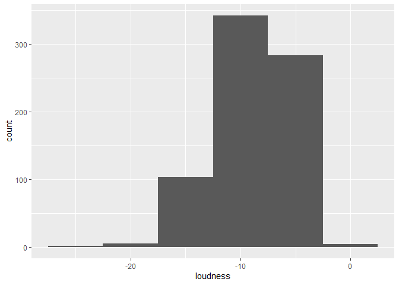
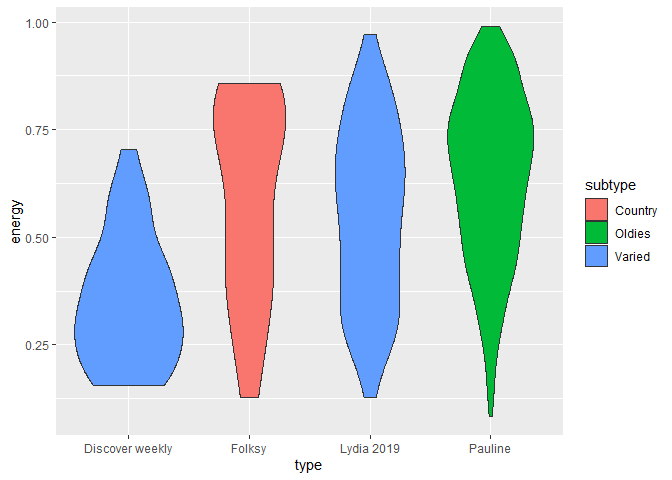
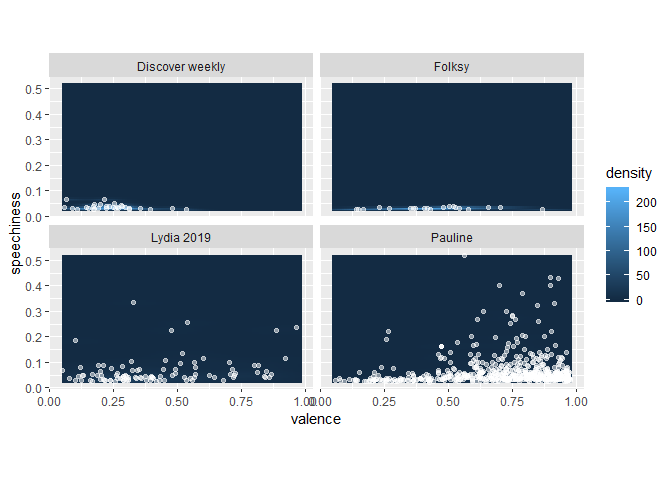

Everyday Music Listening
================

``` r
library(tidyverse)
```

    ## -- Attaching packages -------------------------------------------------------------------------------- tidyverse 1.3.0 --

    ## v ggplot2 3.2.1     v purrr   0.3.3
    ## v tibble  2.1.3     v dplyr   0.8.4
    ## v tidyr   1.0.2     v stringr 1.4.0
    ## v readr   1.3.1     v forcats 0.4.0

    ## -- Conflicts ----------------------------------------------------------------------------------- tidyverse_conflicts() --
    ## x dplyr::filter() masks stats::filter()
    ## x dplyr::lag()    masks stats::lag()

``` r
library(spotifyr)
source('spotify.R')
```

``` r
get_playlist_audio_features('spotify', '37i9dQZEVXcMtOyc7YD1pC')
```

    ## # A tibble: 30 x 61
    ##    playlist_id playlist_name playlist_img playlist_owner_~ playlist_owner_~
    ##    <chr>       <chr>         <chr>        <chr>            <chr>           
    ##  1 37i9dQZEVX~ Discover Wee~ https://new~ Spotify          spotify         
    ##  2 37i9dQZEVX~ Discover Wee~ https://new~ Spotify          spotify         
    ##  3 37i9dQZEVX~ Discover Wee~ https://new~ Spotify          spotify         
    ##  4 37i9dQZEVX~ Discover Wee~ https://new~ Spotify          spotify         
    ##  5 37i9dQZEVX~ Discover Wee~ https://new~ Spotify          spotify         
    ##  6 37i9dQZEVX~ Discover Wee~ https://new~ Spotify          spotify         
    ##  7 37i9dQZEVX~ Discover Wee~ https://new~ Spotify          spotify         
    ##  8 37i9dQZEVX~ Discover Wee~ https://new~ Spotify          spotify         
    ##  9 37i9dQZEVX~ Discover Wee~ https://new~ Spotify          spotify         
    ## 10 37i9dQZEVX~ Discover Wee~ https://new~ Spotify          spotify         
    ## # ... with 20 more rows, and 56 more variables: danceability <dbl>,
    ## #   energy <dbl>, key <int>, loudness <dbl>, mode <int>, speechiness <dbl>,
    ## #   acousticness <dbl>, instrumentalness <dbl>, liveness <dbl>, valence <dbl>,
    ## #   tempo <dbl>, track.id <chr>, analysis_url <chr>, time_signature <int>,
    ## #   added_at <chr>, is_local <lgl>, primary_color <lgl>, added_by.href <chr>,
    ## #   added_by.id <chr>, added_by.type <chr>, added_by.uri <chr>,
    ## #   added_by.external_urls.spotify <chr>, track.artists <list>,
    ## #   track.available_markets <list>, track.disc_number <int>,
    ## #   track.duration_ms <int>, track.episode <lgl>, track.explicit <lgl>,
    ## #   track.href <chr>, track.is_local <lgl>, track.name <chr>,
    ## #   track.popularity <int>, track.preview_url <chr>, track.track <lgl>,
    ## #   track.track_number <int>, track.type <chr>, track.uri <chr>,
    ## #   track.album.album_type <chr>, track.album.artists <list>,
    ## #   track.album.available_markets <list>, track.album.href <chr>,
    ## #   track.album.id <chr>, track.album.images <list>, track.album.name <chr>,
    ## #   track.album.release_date <chr>, track.album.release_date_precision <chr>,
    ## #   track.album.total_tracks <int>, track.album.type <chr>,
    ## #   track.album.uri <chr>, track.album.external_urls.spotify <chr>,
    ## #   track.external_ids.isrc <chr>, track.external_urls.spotify <chr>,
    ## #   video_thumbnail.url <lgl>, key_name <chr>, mode_name <chr>, key_mode <chr>

``` r
spotify_features <- tribble(
    ~type, ~subtype, ~user, ~playlist,
    'Discover weekly', 'Varied', 'spotify', '37i9dQZEVXcMtOyc7YD1pC',
    'Pauline', 'Oldies', '1113203344', '6aSWHR10hKTYP3jYfbJiK2',
    'Lydia 2019', 'Varied', 'spotify', '37i9dQZF1EtkiLBFgtrmPK',
    'Folksy', 'Country', 'the_halfblood_princess', '3vsgMMWPMBWq68WhsSf48T'
) %>% 
  mutate(features = map2(user, playlist, get_playlist_audio_features)) %>% 
  select(type, subtype, features) %>% 
   unnest(features)
spotify_features
```

    ## # A tibble: 738 x 63
    ##    type  subtype playlist_id playlist_name playlist_img playlist_owner_~
    ##    <chr> <chr>   <chr>       <chr>         <chr>        <chr>           
    ##  1 Disc~ Varied  37i9dQZEVX~ Discover Wee~ https://new~ Spotify         
    ##  2 Disc~ Varied  37i9dQZEVX~ Discover Wee~ https://new~ Spotify         
    ##  3 Disc~ Varied  37i9dQZEVX~ Discover Wee~ https://new~ Spotify         
    ##  4 Disc~ Varied  37i9dQZEVX~ Discover Wee~ https://new~ Spotify         
    ##  5 Disc~ Varied  37i9dQZEVX~ Discover Wee~ https://new~ Spotify         
    ##  6 Disc~ Varied  37i9dQZEVX~ Discover Wee~ https://new~ Spotify         
    ##  7 Disc~ Varied  37i9dQZEVX~ Discover Wee~ https://new~ Spotify         
    ##  8 Disc~ Varied  37i9dQZEVX~ Discover Wee~ https://new~ Spotify         
    ##  9 Disc~ Varied  37i9dQZEVX~ Discover Wee~ https://new~ Spotify         
    ## 10 Disc~ Varied  37i9dQZEVX~ Discover Wee~ https://new~ Spotify         
    ## # ... with 728 more rows, and 57 more variables: playlist_owner_id <chr>,
    ## #   danceability <dbl>, energy <dbl>, key <int>, loudness <dbl>, mode <int>,
    ## #   speechiness <dbl>, acousticness <dbl>, instrumentalness <dbl>,
    ## #   liveness <dbl>, valence <dbl>, tempo <dbl>, track.id <chr>,
    ## #   analysis_url <chr>, time_signature <int>, added_at <chr>, is_local <lgl>,
    ## #   primary_color <lgl>, added_by.href <chr>, added_by.id <chr>,
    ## #   added_by.type <chr>, added_by.uri <chr>,
    ## #   added_by.external_urls.spotify <chr>, track.artists <list>,
    ## #   track.available_markets <list>, track.disc_number <int>,
    ## #   track.duration_ms <int>, track.episode <lgl>, track.explicit <lgl>,
    ## #   track.href <chr>, track.is_local <lgl>, track.name <chr>,
    ## #   track.popularity <int>, track.preview_url <chr>, track.track <lgl>,
    ## #   track.track_number <int>, track.type <chr>, track.uri <chr>,
    ## #   track.album.album_type <chr>, track.album.artists <list>,
    ## #   track.album.available_markets <list>, track.album.href <chr>,
    ## #   track.album.id <chr>, track.album.images <list>, track.album.name <chr>,
    ## #   track.album.release_date <chr>, track.album.release_date_precision <chr>,
    ## #   track.album.total_tracks <int>, track.album.type <chr>,
    ## #   track.album.uri <chr>, track.album.external_urls.spotify <chr>,
    ## #   track.external_ids.isrc <chr>, track.external_urls.spotify <chr>,
    ## #   video_thumbnail.url <lgl>, key_name <chr>, mode_name <chr>, key_mode <chr>

``` r
spotify_features %>%
  ## Try different features and different summary functions.
  summarise(M = mean(danceability, SD = sd(danceability)))
```

    ## # A tibble: 1 x 1
    ##       M
    ##   <dbl>
    ## 1 0.636

``` r
spotify_features%>%
  group_by(type, subtype)%>%
  summarise(M = mean(danceability, SD = sd(danceability)))
```

    ## # A tibble: 4 x 3
    ## # Groups:   type [4]
    ##   type            subtype     M
    ##   <chr>           <chr>   <dbl>
    ## 1 Discover weekly Varied  0.463
    ## 2 Folksy          Country 0.537
    ## 3 Lydia 2019      Varied  0.608
    ## 4 Pauline         Oldies  0.653

``` r
spotify_features%>%
  ggplot(aes(x=loudness)) + geom_histogram(binwidth = 5)
```

<!-- -->

``` r
spotify_features%>%
  group_by(type)%>%
  ggplot(aes(x = type, y = energy, fill = subtype)) + geom_violin()
```

<!-- -->

``` r
spotify_features %>% 
  ggplot(aes(x = valence, y = speechiness)) + 
  facet_wrap(~ type) +
  stat_density_2d(
    geom = 'raster', 
    aes(fill = stat(density)), 
    contour = FALSE
  ) + 
  geom_jitter(colour = 'white', alpha = 0.5) + 
  coord_equal()
```

<!-- -->
